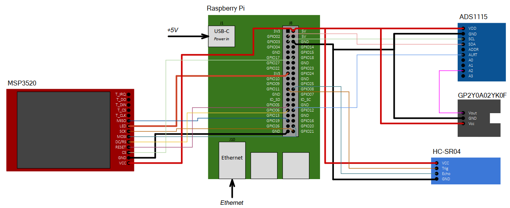

## Вариант 2 курсового проекта дисциплины "Операционные системы" - В02

__Описание задания:__  
Необходимо разработать прототип встраиваемой системы, как совокупность программного обеспечения и стенда на базе Raspberry Pi4, которая позволяла бы определять c помощью двух ультразвуковых дальномеров HC-SR04 и GP2Y0A02YK0F расстояние до препятствия и выводить результат на LCD-экран. Результат измерения расстояния (или серии измеренных расстояний) должны также выводиться в терминале персонального компьютера, подключенного к встраиваемой системе через ssh-соединение.   

__Общая схема и принципы работы встраиваемой системы:__  
Схема соединений всего используемого оборудования представлена на рисунке ниже:  

__Перечень используемого оборудования:__
* микрокомпьютер Raspberry Pi 4;
* отладочная плата OS с подключенными: дальномерами HC-SR04, GP2Y0A02YK0F (поключение через ADC1115), а также LCD MSP3521;
* персональный компьютер c установленным ПО (Putty, WinSCP, Git).

__Требования к работе встраиваемой системы:__  
1. Встраиваемая система должна обеспечивать измерения расстояния и вывод его на экран за счет выполнения трех основных программ: 1 – программа, принимающая сигналы с дальномера №1, 2 – программа, принимающая сигналы с дальномера №2, 3 – программа, получающая данные от программ 1 и 2 по одному из способов межпроцессного взаимодействия (именованные и неименованные каналы) и выводящее измеряемые расстояния на LCD-экран.
2. Программы-1 и -2 должны обеспечивать взаимодействие RPi 4 с модулями ультразвуковых дальномеров по интерфейсам GPIO для HC-SR04 и I2C для GP2Y0A02YK0F, работают в многопоточном режиме и выполняют следующие функции:
* настройка режима работы дальномера и его тип подключения по аргументу при старте или через команду по именованным каналам;
* чтение или вычисление значений расстояния по подключенным к интерфейсам RPi дальномерам в метрах;
* выдача данных о расстоянии с временной меткой системы по именованным каналам;
* прием команд остановки и старта работы по именованным каналам;
3. Программа-3 должна обеспечивать взаимодействие с программами-1,-2, стандартным вводом, выводит информацию на LCD-экран по SPI, работает в многопоточном режиме, а также выполняет следующие функции:
* обмен сообщениям по именованным каналам с приложениями-1,-2;
* конфигурирует работу SPI интерфейса по аргументам при старте или через команду по именованным каналам;
* вывод информации на LCD-экран по SPI в формате: «время измерения № х: _____» (hh:mm:ss), «расстояние № х дальномера 1: _______» (м); «расстояние № х дальномера 2: _______» (м); «усредненное расстояние № х: _______» (м);
* обмен сообщениями со стандартным потоком ввода/вывода, в том числе прием команд от пользователя (start, stop, killall).
4. Встраиваемая система должна обеспечивать выдачу результатов работы на консоль в следующем формате: 
* сообщение 1 типа: «время измерения № х: _____» (hh:mm:ss);
* сообщение 2 типа: «усредненное расстояние № х: _______» (м);

__Порядок выполнения и сдачи [курсового проекта](var_02_task.md):__
1. [Этап проекта №1](var_02_stage_01.md)
2. [Этап проекта №2](var_02_stage_02.md)
3. [Этап проекта №3](var_02_stage_03.md)
4. [Этап проекта №4](var_02_stage_04.md)
5. [Этап проекта №5](var_02_stage_05.md)
6. [Этап проекта №6](var_02_stage_06.md)
7. [Этап проекта №7](var_02_stage_07.md)
8. [Этап проекта №8](var_02_stage_08.md)
