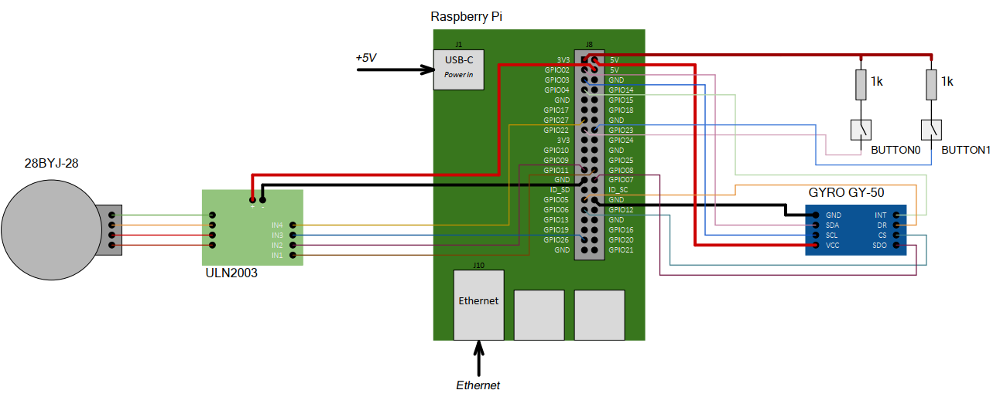

## Вариант 5 курсового проекта дисциплины "Операционные системы" - В05

__Описание задания:__  
Необходимо разработать прототип встраиваемой системы, как совокупность программного обеспечения и стенда на базе Raspberry Pi4, которая управляла бы шаговым двигателем, изменяя угол поворота по данным от гироскопа, вращающегося в одной плоскости. Встраиваемая система должна обеспечивать изменение угла поворота в ручном режиме по нажатию на кнопки «влево», «вправо». Все действия должны дублироваться в терминал персонального компьютера, подключенного к встраиваемой системе через ssh-соединение.   

__Общая схема и принципы работы встраиваемой системы:__  
Схема соединений всего используемого оборудования представлена на рисунке ниже:  

__Перечень используемого оборудования:__
* микрокомпьютер Raspberry Pi 4;
* отладочная плата OS с подключенными: модулем 3-х осевого гироскопа GY-50 (L3G4200D), драйвером ULN2003 и подключенным к нему 28BYJ-48;
* персональный компьютер c установленным ПО (Putty, WinSCP, Git).

__Требования к работе встраиваемой системы:__  
1. Встраиваемая система должна управлять шаговым двигателем за счет выполнения трех основных программ: 1 – программа, принимающая сигналы с гироскопа и определяющая угол поворота электродвигателя по именованному каналу; 2 – программа, по нажатию на кнопку передающая значения инкремент/декремент угла поворота шагового двигателя по именованному каналу, 3 – программа, работающая с драйвером электродвигателя, управляя его движением, и принимающая данные от программ-1,-2 по именованным каналам.
2. Программа-1 должна обеспечивать взаимодействие RPi с гироскопом GY-50 (L3G4200D) по интерфейсу I2C и выполняет следующие функции:
* инициализирует и настраивает интерфейс I2C;
* считывает значения угла поворота в одной из плоскостей вращения модуля GY-50 (L3G4200D) с частотой 1кГц;
* отправяет значения приращения угла поворота с временной меткой системы по именованным каналам с частотой 10 Гц.
3. Программа-2 должна обеспечивать считывание данных с кнопок отладочной платы OS для изменения угла поворота шагового двигателя, при этом выполняются следующие функции:
* обработка нажатия кнопки «влево» (BUTTON1) или «вправо» (BUTTON0) с защитой от дребезга в 1 секунду - увеличение и уменьшение значения угла поворота соответственно;
* передаваемое через аргумент значение угла поворота по одновременному нажатию двух кнопок;
* обмен сообщениями со стандартным потоком ввода/вывода для изменения стандартного угла поворота по нажатию на кнопку;
* обмен сообщениям по именованным каналам с приложениями-1,-3.
4. Программа-3 должна обеспечивать взаимодействие RPi с драйвером электродвигателя ULN2003 с помощью GPIO, обеспечивает взаимодействие с программами-1,-2, и стандартным потоком ввода/ввывода, работает в многопоточном режиме и выполняет следующие функции:
* настройка и инициализация GPIO для взаимодействия с драйвером;
* чтение значения угла поворота двигателя и направление движения;
* управление электродвигаетелем;
* обмен сообщениям (прием значений приращения угла поворота) по именованным каналам с приложениями-1,-2;
* обмен сообщениями со стандартным потоком ввода/вывода, а также прием команд от пользователя (start, stop, set_angle).
5. Встраиваемая система должна обеспечивать выдачу результатов работы на консоль в следующем формате:
* «№х. Время изменения положения двигателя: ________» (hh:mm:ss), 
* «№х. Передаваемое приращение угла поворота: _______» (GYR/BTN:[градусы]).

__Порядок выполнения и сдачи [курсового проекта](var_05_task.md):__
1. [Этап проекта №1](var_05_stage_01.md)
2. [Этап проекта №2](var_05_stage_02.md)
3. [Этап проекта №3](var_05_stage_03.md)
4. [Этап проекта №4](var_05_stage_04.md)
5. [Этап проекта №5](var_05_stage_05.md)
6. [Этап проекта №6](var_05_stage_06.md)
7. [Этап проекта №7](var_05_stage_07.md)
8. [Этап проекта №8](var_05_stage_08.md)
