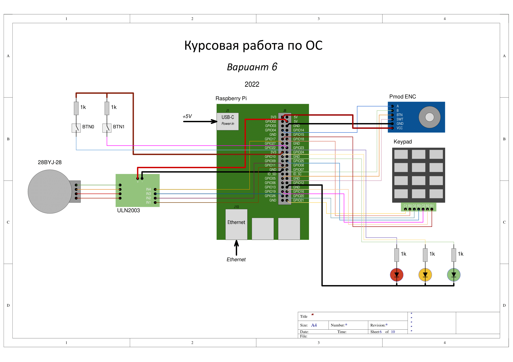

## Вариант 6 курсового проекта дисциплины "Операционные системы"

__Описание задания:__  
Необходимо разработать прототип встраиваемой системы, как совокупность программного обеспечения и стенда на базе Raspberry Pi4, которая управляла бы шаговым двигателем, изменяя угол поворота по данным от энкодера или по данным, вводимым с 12-кнопочной клавиатуры. Все действия должны дублироваться в терминал персонального компьютера, подключенного к встраиваемой системе через ssh-соединение.   

__Общая схема и принципы работы встраиваемой системы:__  
Схема соединений всего используемого оборудования представлена на рисунке ниже:  

__Перечень используемого оборудования:__
* микрокомпьютер Raspberry Pi 4;
* отладочная плата OS с подключенными: энкодером, драйвером ULN2003 и подключенным к нему 28BYJ-48, 12-кнопочной клавиатурой;
* персональный компьютер c установленным ПО (Putty, WinSCP, Git).

__Требования к работе встраиваемой системы:__  
1. Встраиваемая система должна обеспечивать управление шаговым электродвигателем и по значениям углов поворота энкодера или введенным значениям с 12-кнопочной клавиатуры, вывод данной информации в консоль за счет выполнения трех основных программ: 1 – программа, принимающая сигналы с датчика поворота (энкодера) и определяющая угол поворота электродвигателя по именованному каналу; 2 – программа, получающая данные от клавиатуры и передающая значения инкремент/декремент угла поворота шагового двигателя по именованному каналу, 3 – программа, работающая с драйвером электродвигателя, управляя его движением, и принимающая данные от программ-1,-2 по именованным каналам.
2. Программа-1 должна обеспечивать взаимодействие RPi с датчиком поворота (энкодер) по выводам GPIO и выполняют следующие функции:
* конфигурация выводов GPIO для чтения значений с датчика поворота (энкодера);
* преобразование данных датчика в значение приращения угла поворота;
* отправка данных о приращении угла поворота энкодера по именованным каналам с частотой 100 Гц.
3. Программа-2 должна обеспечивать взаимодействие RPi с 12-кнопочной клавиатурой, обеспечивает взаимодействие с программами-1,-2, со стандартным потоком ввода/вывода; работает в многопоточном режиме, а также выполняет следующие функции:
•	чтение значений с клавиатуры и перевод их в установочный угол поворота для электродвигателя;
•	обмен сообщениям по именованным/не именованным каналам с приложениями-1,-2;
•	обмен сообщениями со стандартным потоком ввода/вывода
4. Программа-3 должна обеспечивать взаимодействие RPi с драйвером электродвигателя ULN2003 с помощью GPIO, обеспечивает взаимодействие с программами-1,-2, и стандартным потоком ввода/ввывода, работает в многопоточном режиме и выполняет следующие функции:
* настройка и инициализация GPIO для взаимодействия с драйвером;
* чтение значения угла поворота двигателя и направление движения;
* управление электродвигаетелем;
* обмен сообщениям (прием значений приращения угла поворота) по именованным каналам с приложениями-1,-2;
* обмен сообщениями со стандартным потоком ввода/вывода, а также прием команд от пользователя (start, stop, set_angle).
5. Встраиваемая система должна обеспечивать выдачу результатов работы на консоль в следующем формате:
* «время изменения положения двигателя: ________» (hh:mm:ss), 
* «приращение угла поворота: _______» (GYR/BTN:[градусы]).

__Порядок выполнения и сдачи [курсового проекта](task_v06.md):__
1. [Лабораторная работа №1](lab_01.md)
2. [Лабораторная работа №2](lab_02.md)
3. [Лабораторная работа №3](lab_03.md)
4. [Лабораторная работа №4](lab_04.md)
5. [Лабораторная работа №5](lab_05.md)
6. [Лабораторная работа №6](lab_06.md)
7. [Лабораторная работа №7](lab_07.md)
8. [Лабораторная работа №8](lab_08.md)

