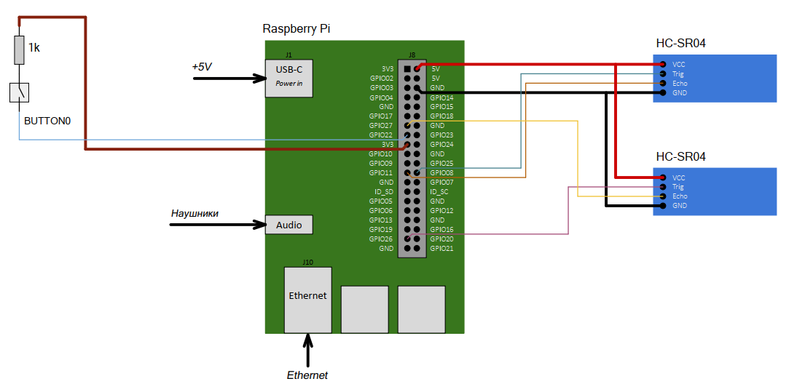

## Вариант 7 курсового проекта дисциплины "Операционные системы" - В07

__Описание задания:__  
Необходимо разработать прототип встраиваемой системы, как совокупность программного обеспечения и стенда на базе Raspberry Pi4, которая реализует функции терменвокса с помощью двух дальномеров (один отвечает за громкость звука, второй за ноту) и стандартного звукового выхода. Все действия должны дублироваться в терминал персонального компьютера, подключенного к встраиваемой системе через ssh-соединение.   

__Общая схема и принципы работы встраиваемой системы:__  
Схема соединений всего используемого оборудования представлена на рисунке ниже:  

__Перечень используемого оборудования:__
* микрокомпьютер Raspberry Pi 4;
* отладочная плата OS с подключенными: дальномерами HC-SR04, наушниками;
* персональный компьютер c установленным ПО (Putty, WinSCP, Git).

__Требования к работе встраиваемой системы:__  
1. Встраиваемая система должна обеспечивать воспроизведение звука одной октавы и пятью уровнями громкости, которые задаются двумя дальномерами, вывод данной информации в консоль и в web-сервер за счет выполнения трех основных программ: 1 – программа, принимает и обрабатывает сигналы дальномера № 1, рассчитывает дальность и передает ее по неименованым каналам, 2 – программа, принимает и обрабатывает сигналы дальномера №2, рассчитывает дальность и передает ее по неименованым каналам, 3 – программа, получает данные от программ 1 и 2 по неименованным каналам, высчитывает ноту и громкость, воспроизводит ее и выводит результат работы в терминал персонального компьютера, подключенного к встраиваемой системе через ssh-соединение.
2. Программы-1 и -2 должны обеспечивать взаимодействие RPi с дальномерам с помощью GPIO, преобразовывать принятые сигналы в расстояние и выполнять следующие функции:
* настройка и инициализация GPIO для взаимодействия с дальномерами;
* определение расстояния до преграды с частотой в 0,1 кГц;
* передача значений расстояния в см по неименованным каналам.
3. Программа-3 должна обеспечивать взаимодействие RPi со стандартным аудиовыходом, с кнопками для калибровки, с программами-1,-2, и стандартным потоком ввода/вывода; работает в многопоточном режиме, а также выполняет следующие функции:
* обмен сообщениям по не именованным каналам с приложениями-1,-2 (прием рассчитанных расстояний);
* по нажатию на кнопку BUTTON0 переходит в режим калибровки расстояний для определения самой высокой ноты и максимальной громкости;
* обмен сообщениями со стандартным потоком ввода/вывода, в том числе прием команд от пользователя (start, stop, set_max, set_min).
4. Встраиваемая система должна обеспечивать выдачу ноты и громкости, режима калибровки и времени на консоль в следующем формате: 
* «время _______» (hh:mm:ss), «нота ______», «громкость ______»;
* «время _______» (hh:mm:ss), «установка максимального уровня»;
* «время _______» (hh:mm:ss), «установка минимального уровня».

__Порядок выполнения и сдачи [курсового проекта](var_07_task.md):__
1. [Этап проекта №1](var_07_stage_01.md)
2. [Этап проекта №2](var_07_stage_02.md)
3. [Этап проекта №3](var_07_stage_03.md)
4. [Этап проекта №4](var_07_stage_04.md)
5. [Этап проекта №5](var_07_stage_05.md)
6. [Этап проекта №6](var_07_stage_06.md)
7. [Этап проекта №7](var_07_stage_07.md)
8. [Этап проекта №8](var_07_stage_08.md)
