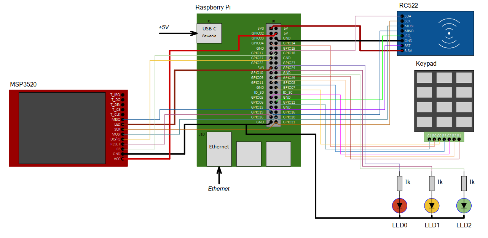

## Вариант 8 курсового проекта дисциплины "Операционные системы" - В08

__Описание задания:__  
Необходимо разработать прототип встраиваемой системы, как совокупность программного обеспечения и стенда на базе Raspberry Pi4, которая реализует функции системы контроля доступа по RF-метке и/или паролю. Должны быть реализованы функции смены пароля и RF-метки, данные работы выводятся на LCD-экран, статус работы отображается на светодиодах. Все действия должны дублироваться в терминал персонального компьютера, подключенного к встраиваемой системе через ssh-соединение.   

__Общая схема и принципы работы встраиваемой системы:__  
Схема соединений всего используемого оборудования представлена на рисунке ниже:  

__Перечень используемого оборудования:__
* микрокомпьютер Raspberry Pi 4;
* отладочная плата OS с подключенными: RFID-модулем RC522, 12-кнопочной клавиатурой, светодиодами, а также LCD MSP3521;
* персональный компьютер c установленным ПО (Putty, WinSCP, Git).

__Требования к работе встраиваемой системы:__  
1. Встраиваемая система должна обеспечивать контроль доступа по RF-метке и паролю, создание/редактирование/удаление данных о верной метке и пароле, отображение статуса ввода на LCD-экран, вывод информации о работе в консоль. Встраиваемая система содержит три основные программы: 1 – программа, принимает и обрабатывает сигналы RFID-модуля, 2 – программа, осуществляет вывод информации на LCD-экран, 3 – программа, получает данные от кнопок клавиатуры, программ 1 и 2 по одному из способов межпроцессного взаимодействия (именованные  каналы), реализует логику создания-редактирования-удаления-принятия-отказа паролей и меток, выводит результат работы в терминал персонального компьютера, подключенного к встраиваемой системе через ssh-соединение.
2. Программа-1 должна обеспечивать взаимодействие RPi с RFID-модулем по интерфейсу SPI и выполняет следующие функции:
* настройка и инициализация RFID-модуля;
* обеспечивает считывание данных с RFID-модуля;
* передача считанных данных метки по именованным каналам.
3. Программа-2 должна обеспечивать взаимодействие RPi с LCD-экраном по SPI интерфейсу и выполняет следующие функции:
* настройка и инициализация LCD-экрана по SPI;
* выводит построчно информаци о работе встраиваемой системы.
4. Программа-3 должна обеспечивать взаимодействие RPi 4 с 12-кнопочной клавиатурой и выполняет следующие функции:
* считывает значения нажимаемых кнопок;
* реализует логику проверки пароля и метки, формирование соответствующих строк для LCD-экрана;
* зажигает соответствующие светодиоды при верном и ошибочном вводе пароля;
* позволяет создавать пароли, удалять их по командам с 12-кнопочной клавиатуры.
* обмен сообщениям по именованным каналам с приложениями-1,-2;
* обмен сообщениями со стандартным потоком ввода/вывода, в том числе прием команд от пользователя (start, stop, set_password, delete_password).
5. Встраиваемая система должна обеспечивать выдачу режима работы, нажатия кнопок и времени в следующем формате (на LCD-дисплей и в консоль): 
* «Время ______ («hh:mm:ss»), режим: (открыт/закрыт)»;
* «Время ______ («hh:mm:ss»), срабатывание метки (успешно/ошибка)»;
* «Время ______ («hh:mm:ss»), ввод пароля (успешно/ошибка)»;
* «Время ______ («hh:mm:ss»), удаление пароля (успешно/ошибка)»;
* «Время ______ («hh:mm:ss»), добавление пароля (успешно/ошибка)».

__Порядок выполнения и сдачи [курсового проекта](var_08_task.md):__
1. [Этап проекта №1](var_08_stage_01.md)
2. [Этап проекта №2](var_08_stage_02.md)
3. [Этап проекта №3](var_08_stage_03.md)
4. [Этап проекта №4](var_08_stage_04.md)
5. [Этап проекта №5](var_08_stage_05.md)
6. [Этап проекта №6](var_08_stage_06.md)
7. [Этап проекта №7](var_08_stage_07.md)
8. [Этап проекта №8](var_08_stage_08.md)
