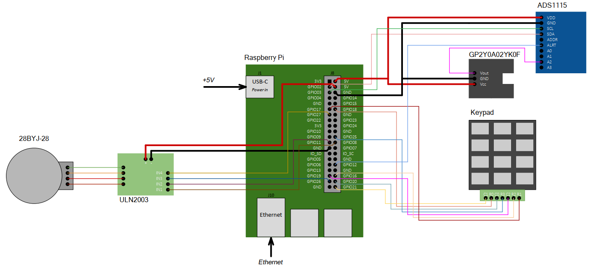

## Вариант 10 курсового проекта дисциплины "Операционные системы" - В10

__Описание задания:__  
Необходимо разработать прототип встраиваемой системы, как совокупность программного обеспечения и стенда на базе Raspberry Pi4, которая управляла бы шаговым двигателем, изменяя угол поворота по данным вводимым с 12-кнопочная клавиатуры при срабатывании дальномера на определенном расстоянии. Все действия должны дублироваться в терминал персонального компьютера, подключенного к встраиваемой системе через ssh-соединение.   

__Общая схема и принципы работы встраиваемой системы:__  
Схема соединений всего используемого оборудования представлена на рисунке ниже:  

__Перечень используемого оборудования:__
* микрокомпьютер Raspberry Pi 4;
* отладочная плата OS с подключенными: дальномер GP2Y0A02YK0F (поключение через ADC1115), 12-кнопочной клавиатурой, драйвером ULN2003 и подключенным к нему 28BYJ-48;
* персональный компьютер c установленным ПО (Putty, WinSCP, Git).

__Требования к работе встраиваемой системы:__  
1. Встраиваемая система должна обеспечивать управление шаговым электродвигателем и по введенным значениям с 12-кнопочной клавиатуры, вывод данной информации в консоль за счет выполнения трех основных программ: 1 – программа, принимает и обрабатывает сигналы дальномера; 2 – программа, получающая данные от клавиатуры и передающая значения инкремент/декремент угла поворота шагового двигателя по именованному каналу, 3 – программа, работающая с драйвером электродвигателя, управляя его движением, и принимающая данные от программ-1,-2 по именованным каналам.
2. Программа-1 должна обеспечивать взаимодействие RPi с дальномером и выполняет следующие функции:
* настройка режима работы (частота опроса данных) дальномера по аргументу при старте или через команду по именованным каналам;
* чтение или вычисление значений расстояния по подключенным к интерфейсам RPi дальномерам в метрах;
* выдача данных о расстоянии с временной меткой системы по именованным каналам;
* прием команд остановки и старта работы по именованным каналам;
3. Программа-2 должна обеспечивать взаимодействие RPi с 12-кнопочной клавиатурой, обеспечивает взаимодействие с программой-3, со стандартным потоком ввода/вывода; работает в многопоточном режиме, а также выполняет следующие функции:
•	чтение значений с клавиатуры и перевод их в установочный угол поворота для электродвигателя;
•	обмен сообщениям по именованным/не именованным каналам с приложением-3;
•	обмен сообщениями со стандартным потоком ввода/вывода
4. Программа-3 должна обеспечивать взаимодействие RPi с драйвером электродвигателя ULN2003 с помощью GPIO, обеспечивает взаимодействие с программами-1,-2, и стандартным потоком ввода/ввывода, работает в многопоточном режиме и выполняет следующие функции:
* настройка и инициализация GPIO для взаимодействия с драйвером;
* чтение значения угла поворота двигателя и направление движения при верном определенном уровне срабатывания дальномера;
* обмен сообщениям (прием значений приращения угла поворота) по именованным каналам с программой-2;
* управление электродвигаетелем;
* обмен сообщениями со стандартным потоком ввода/вывода, а также прием команд от пользователя (start, stop, set_angle).
5. Встраиваемая система должна обеспечивать выдачу результатов работы на консоль в следующем формате:
* «время изменения положения двигателя: ______» (hh:mm:ss), 
* «Время ______ («hh:mm:ss»), расстояние: (разрешено/запрещено)»;
* «Время ______ («hh:mm:ss»), установка угла (успешно/ошибка)»;
* «приращение угла поворота: ______» (град).

__Порядок выполнения и сдачи [курсового проекта](var_10_task.md):__
1. [Этап проекта №1](var_10_stage_01.md)
2. [Этап проекта №2](var_10_stage_02.md)
3. [Этап проекта №3](var_10_stage_03.md)
4. [Этап проекта №4](var_10_stage_04.md)
5. [Этап проекта №5](var_10_stage_05.md)
6. [Этап проекта №6](var_10_stage_06.md)
7. [Этап проекта №7](var_10_stage_07.md)
8. [Этап проекта №8](var_10_stage_08.md)

